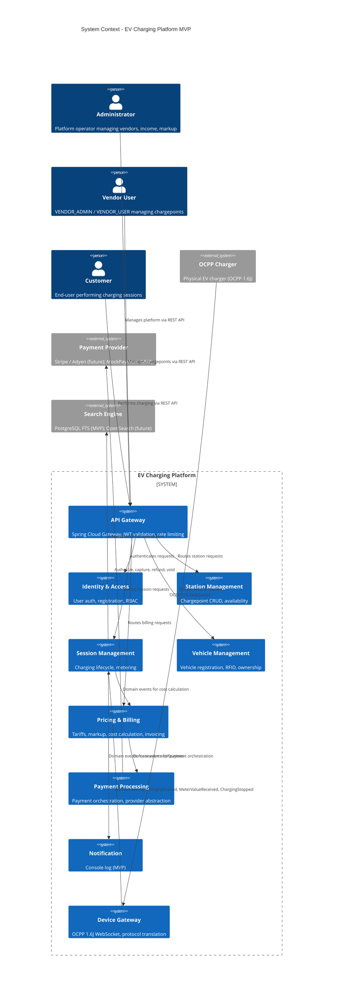

# EV Charging Platform MVP - System Context

## System Overview
A cloud-based modular monolith platform for managing EV charging operations. The platform connects administrators, vendors, customers, and charging devices to enable secure, reliable charging services. External integrations include payment providers, while notifications are console-logged for MVP.

## Actors

| Actor | Type | Description |
|-------|------|-------------|
| **Administrator** | Human | Platform operator managing vendors, viewing income, setting markup, resetting credentials |
| **Vendor** | Human | Chargepoint owner managing resources, viewing income/activity, generating reports |
| **Vendor User** | Human | Vendor employee managing vendor resources per assigned permissions (VENDOR_ADMIN / VENDOR_USER) |
| **Customer** | Human | End-user registering, performing charging sessions, managing vehicles, viewing history |
| **Charging Station (Device)** | System | Physical EV charger communicating via OCPP 1.6J over WebSocket |
| **Charging Station Operator** | Human | Physical installer/operator who registers and maintains the station hardware |

## External Systems

| System | Direction | Purpose | Protocol | MVP Stage |
|--------|-----------|---------|----------|-----------|
| **Payment Provider** | Outbound | Process payments (authorize, capture, refund, void) | REST / HTTPS | MockPayment (MVP); Stripe/Adyen later |
| **OCPP Chargers** | Bidirectional | Charger communication protocol (Start/Stop Transaction, MeterValues, Heartbeat) | WebSocket (OCPP 1.6J) | Full (MVP) |
| **Future: Notification Provider** | Outbound | Email/SMS/Push delivery | REST / SMTP | Console log only (MVP) |
| **Future: Search Engine** | Bidirectional | Advanced search and analytics | REST | PostgreSQL FTS (MVP); OpenSearch later |

## Context Diagram

## External Integrations

| Integration | Protocol | Data Exchanged | Risk |
|-------------|----------|----------------|------|
| **OCPP 1.6J Chargers** | WebSocket (WSS) | Start/StopTransaction, MeterValues, Heartbeat, StatusNotification, Authorize | High — core domain reliability |
| **Payment Provider** | REST/HTTPS | Payment authorization, capture, refund, void | High — financial operations, PCI scope |
| **PostgreSQL (FTS)** | JDBC | Session, customer, vehicle data for search | Low — internal |
| **Future: Notification Provider** | REST/SMTP | Session events, payment confirmations, alerts | Medium — deferred |

## Data Flows

### Inbound
- **Admin/Vendor/Customer requests**: JSON over HTTPS → API Gateway → JWT validation → Module routing
- **OCPP WebSocket frames**: OCPP 1.6J messages → Device Gateway → Domain events → Domain modules
- **Future: Payment provider webhooks**: Payment status updates → Gateway → Payment Processing Module

### Outbound
- **Domain events**: In-process event bus (ApplicationEventPublisher) → Module event handlers
- **Payment provider calls**: Payment Processing Module → REST/HTTPS → External provider
- **Future: Notifications**: Notification Module → Console (MVP) → Email/SMS/Push later

## High-Level Constraints

- Modular monolith architecture (single deployable unit)
- Spring Boot 4 + Java 21
- PostgreSQL single instance, schema-per-module
- In-process domain events (no external message broker for MVP)
- Spring Cloud Gateway for JWT validation and routing
- Containerized deployment with Helm
- Single-region multi-AZ (no multi-region for MVP)

## Key NFR Goals

| Area | Target | Priority |
|------|--------|----------|
| **Performance** | API p95 < 200ms; Charging command < 2s | Must |
| **Availability** | 99.9% uptime | Must |
| **Recovery** | RTO < 30 min, RPO < 1 min | Must |
| **Security** | JWT (RS256/ES256), RBAC, TLS 1.3 | Must |
| **Idempotency** | All mutations idempotent via idempotency key | Must |
| **Audit** | Immutable audit log for all business events | Must |
| **Observability** | Correlation IDs across all modules | Must |
